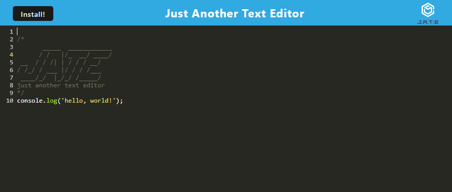
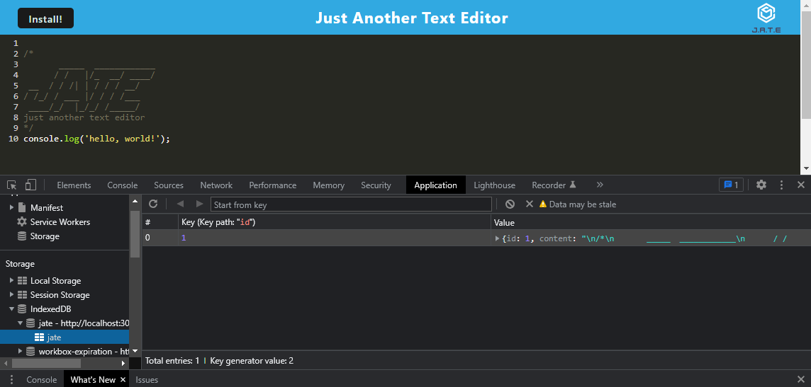

# Module #19 Challenge: Just Another Text Editor

## Description

This project is a **progressive web application (PWA)** JavaScript text editor that runs in the browser. It features a number of data persistence techniques that serve as redundancies in case one of the options is not supported by the browser. The application will also function offline.

In this project, I learned how to ulilize:

* **webpack** to bundle JavaScript
* **HTMLWebpackPlugin** to generalte an HTML page
* **IndexedDB** and **idb** to implement CRUD methods and store structured data to the browser
* **Workbox**, a set of libraries that can generate a production-ready service worker for PWAs
* `manifest.json` to make the app installable

[Check out the deployed application here!]()

## Table of Contents

* [Screenshots](#screenshots)
* [Credits](#credits)
* [Questions](#questions)

## Screenshots

## Credits

* Starter code found [here](https://github.com/coding-boot-camp/cautious-meme)!

## Questions

If you have any questions about this repository, please open an issue. You can also find more of my work at [desguerra](https://github.com/desguerra) on GitHub.